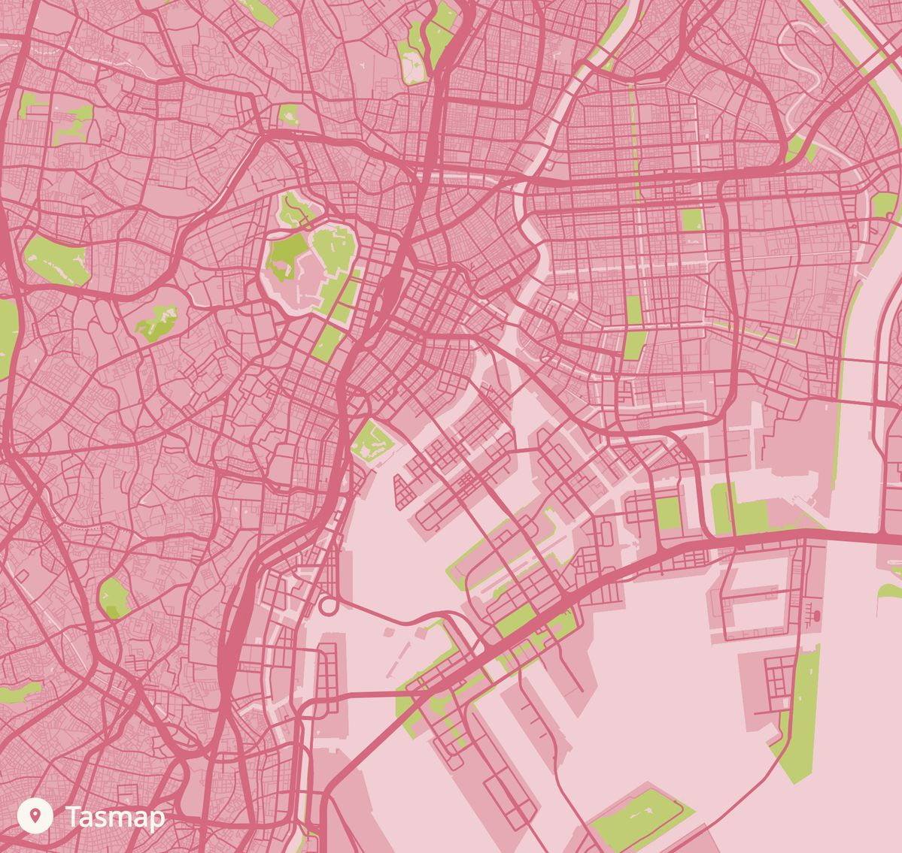
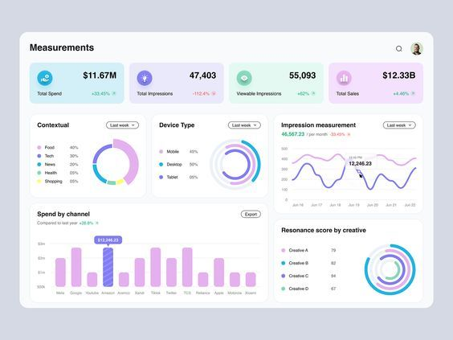

<!-- START HERO — raw HTML, no code fences, no leading spaces --> <section class="hero-panel sky"> 
 <h1>Hi, I’m Nhu Nguyen</h1> 
 Business Analytics student at Monash moving toward <strong>data analyst / data science</strong>. I blend <strong>databases &amp; SQL</strong>, <strong>spatial data</strong>, and <strong>visualisation</strong> with logistics experience. 

  <a class="btn btn-primary" href="about.qmd">About me</a>
  <a class="btn btn-ghost" href="blog.qmd">Read the blog</a>

 <figure class="hero-right">  </figure> </section> <!-- END HERO --> <section class="card block"> <h3>What you’ll find</h3> <ul> <li>Short, clear data stories &amp; visualisations</li> <li>Method notes &amp; reproducible snippets</li> <li>Reflections from logistics → analytics</li> </ul> <h3>New here?</h3> <ul> <li>Read the latest <a href="blog.qmd">blog</a></li> <li>See my code on <a href="https://github.com/Amberlynn9">GitHub</a></li> <li>Get in touch: <a href="mailto:nguyenthuynhu2603@gmail.com">email me</a></li> </ul> </section>

<!-- A different image treatment: compact strip with captions -->
<section class="mini-gallery">
  <figure class="chip tilt-l">
    
    <figcaption>Databases &amp; SQL</figcaption>
  </figure>
  <figure class="chip tilt-r">
    
    <figcaption>Spatial data</figcaption>
  </figure>
  <figure class="chip tilt-l">
    
    <figcaption>Visualisation</figcaption>
  </figure>
</section>
