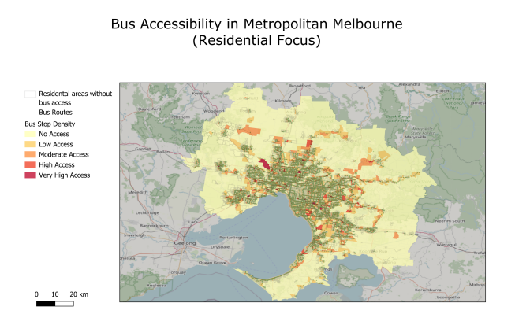

## Overview

How well does Melbourne's bus network actually serve its residents? This project investigates that question using real public transport and census data by combining SQL spatial analysis with GIS visualisation to uncover where the gaps are.

## Data Sources

- **PTV GTFS Data** — routes, stops, trips, and timetables from the Public Transport Victoria Open Data Portal
- **ABS Mesh Block Boundaries** — 2021 census geographic boundaries covering all of Metropolitan Melbourne

Both datasets were loaded into PostgreSQL (with the PostGIS spatial extension) using a Docker environment managed through DBeaver and QGIS.

## What I Did

### Data Cleaning & Preprocessing

- Imported 11 core tables into a dedicated `ptv` schema in PostgreSQL
- Added geometry columns to the stops table using latitude/longitude coordinates (GDA2020 projection, SRID 7844)
- Filtered to bus-only routes (`route_type = 3`) and residential mesh blocks (`MB_CAT21 = 'Residential'`)
- Created a Greater Melbourne subset of 59,483 mesh blocks

### Spatial Analysis

Using `ST_Intersects`, I spatially joined each residential mesh block with bus stop locations to count how many stops fell within each block boundary. This produced a derived table (`bus_stops_per_block`) with stop counts per block.

I also identified residential areas with **zero** bus stops — stored as `residential_no_bus`, to highlight the most underserved zones.

### Visualisation

A heatmap was built in QGIS using the Viridis colour ramp with Natural Breaks (Jenks) classification:

| Accessibility Level | Stop Count |
|---|---|
| No Access | 0 stops |
| Low Access | 1–2 stops |
| Moderate Access | 3–5 stops |
| High Access | 6–10 stops |
| Very High Access | 10+ stops |

## Key Findings

Out of **46,608 total residential mesh blocks** in Metropolitan Melbourne:

- Only **11,264 (24.17%)** contain at least one bus stop
- **76% of residential areas have no direct bus access**
- The average stop count is just **0.43 stops per block**
- Dense coverage is concentrated in inner suburbs (Carlton, Richmond, Brunswick, South Yarra)
- Outer growth corridors — Melton, Clyde North, Wyndham Vale — are heavily underserved

## Spatial Pattern

The heatmap reveals a clear **radial accessibility gradient**: service density decreases steadily with distance from the CBD. Melbourne's transport network is historically CBD-centric, and outer suburbs that depend on buses are the most disadvantaged.

## Implications

These findings highlight a significant transport equity gap. Outer and newly developed suburbs lack reliable bus connectivity despite rapid population growth. The Victorian Government's Bus Reform Plan (2023) identifies similar gaps — this analysis provides spatial evidence to support targeted network expansion.

## Tools Used

`PostgreSQL` · `PostGIS` · `QGIS` · `SQL` · `Docker` · `DBeaver`
