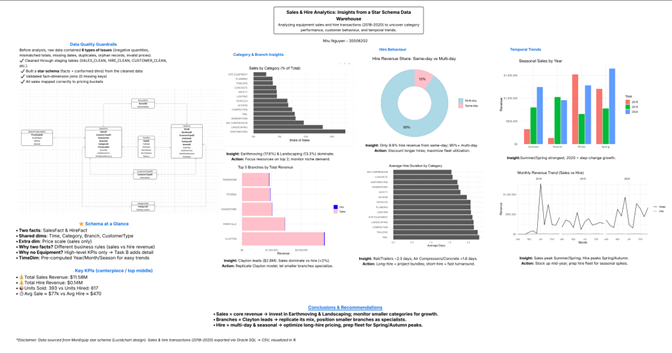

## Overview

This project turned raw, messy operational data from a fictional equipment company (MonEquip) into a fully functioning business intelligence data warehouse — complete with cleaned facts, conformed dimensions, and actionable KPIs.

The dataset covered sales and hire transactions from April 2018 to December 2020.

## The Problem: Dirty Data

Before any analysis could happen, the raw data needed serious cleaning. I identified and resolved **6 types of data errors**:

| Error Type | Description |
|---|---|
| Negative quantities | Sales rows with quantity ≤ 0 |
| Negative/zero prices | Hire rows with invalid total prices |
| Date inconsistencies | END_DATE before START_DATE |
| Duplicate records | CUSTOMER_ID appearing multiple times |
| Orphan foreign keys | Hire rows referencing missing customers, equipment, or staff |
| Mismatched totals | TOTAL_SALES_PRICE ≠ QUANTITY × UNIT_SALES_PRICE |

Each error type was quarantined into a dedicated issue table for audit traceability, then clean versions were built excluding invalid rows.

## Star Schema Design

I designed a **multi-fact constellation (galaxy) schema** with two primary fact tables sharing conformed dimensions:

**Fact Tables:**

- `SalesFact` — one row per sales transaction line
- `HireFact` — one row per hire transaction line

**Shared Dimensions:**

- `TimeDim` — pre-computed Year, Month, Season for trend analysis
- `BranchDim` — company branch locations
- `CategoryDim` — equipment categories (Earthmoving, Landscaping, etc.)
- `CustomerTypeDim` — Business vs Individual customers

**Sales-only Dimension:**

- `SalesPriceScaleDim` — Low / Medium / High price buckets

All fact-dimension joins were validated with zero missing keys before analysis.

## Key Findings

### Revenue Overview (2018–2020)

| Metric | Sales | Hire |
|---|---|---|
| Total Revenue | $11.58M | $0.14M |
| Avg per Transaction | $77,220 | $470 |
| Units | 393 sold | 617 hired |

Sales completely dominate revenue. Hire generates many small, short transactions.

### Top Categories

Earthmoving (17.6%) and Landscaping (13.3%) together account for over 30% of total sales revenue — the company's core strength lies in heavy construction equipment.

### Branch Performance

Clayton branch leads with nearly $2.8M in revenue — more than double Parkville ($1.45M). Clayton has a diverse portfolio across almost all categories and acts as a central revenue hub.

### Seasonality

- Sales peak in **Summer and Spring**, with a broad step-change growth of **+57.5%** in 2020
- Hire peaks in **Spring and Autumn** — aligned with project start and finish windows
- Same-day hires account for only **9.9%** of hire revenue; multi-day rentals dominate

### Year-over-Year Growth

| Period | Growth |
|---|---|
| 2018 → 2019 | +2.4% |
| 2019 → 2020 | +57.5% |

The 2020 jump was broad-based across all months and seasons — suggesting a structural shift in demand rather than a one-off event.

## Visualisation

The final analytics were visualised as a one-page poster in R, combining a star schema diagram, bar charts, donut charts, and a monthly revenue trend line.

## Tools Used

`Oracle SQL` · `R` · `ggplot2` · `Lucidchart` · `DBeaver` · `Star Schema Design`

## Takeaways

This project taught me how real-world data is never clean, and how important it is to build auditable cleaning pipelines before touching any analysis. Designing the star schema also showed me how grain decisions — what one row represents — fundamentally shape what questions you can and can't answer downstream.
